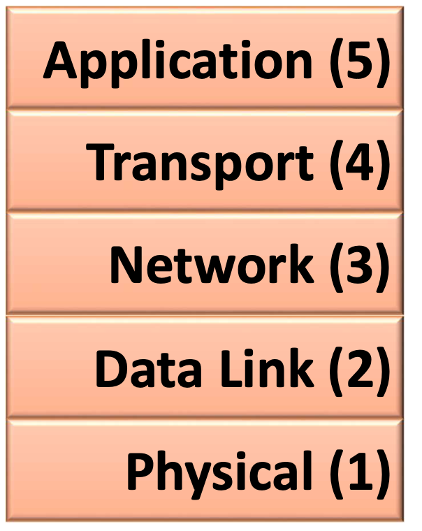
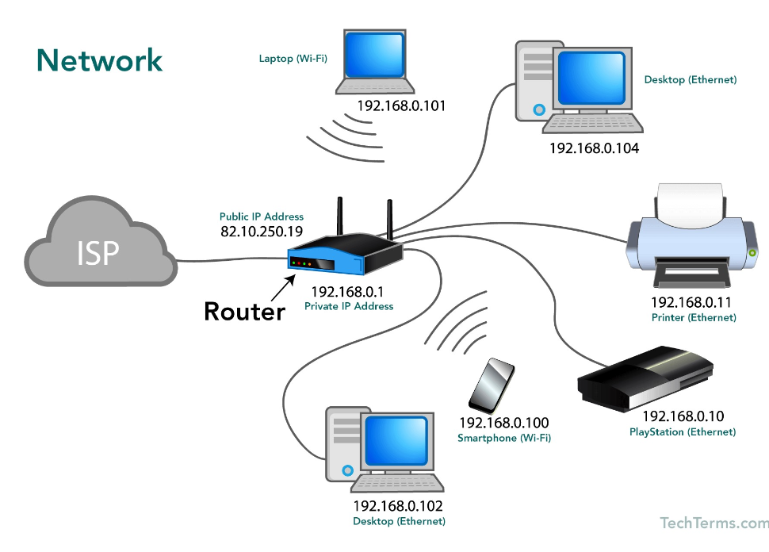
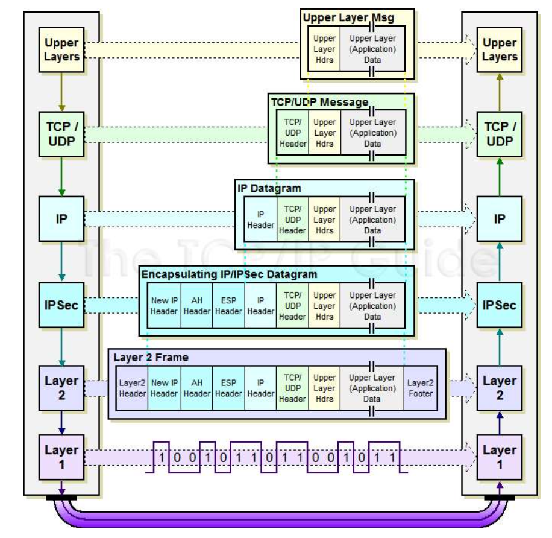
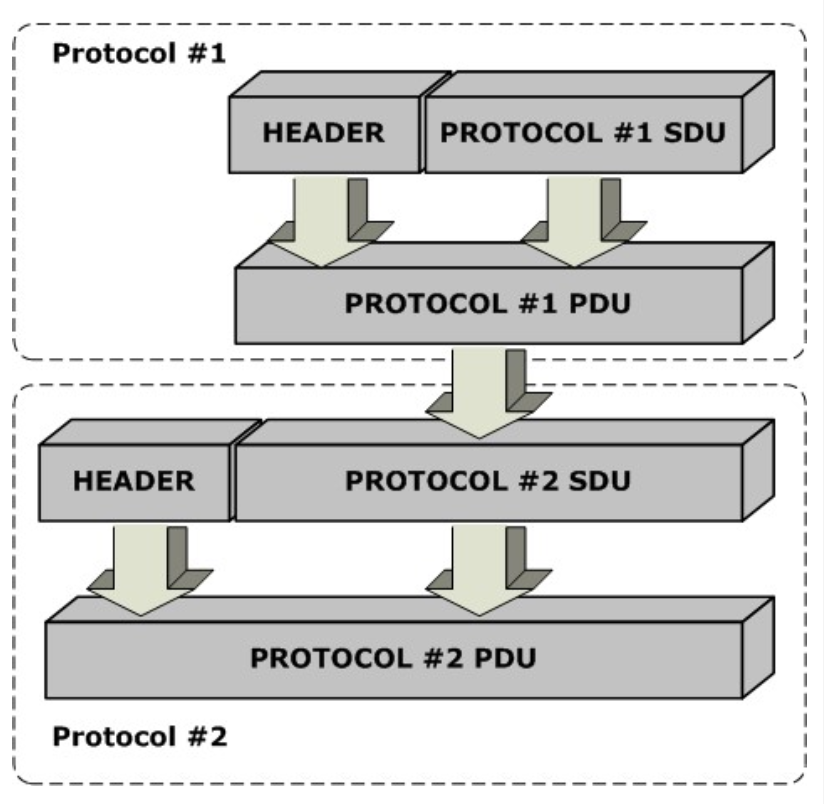
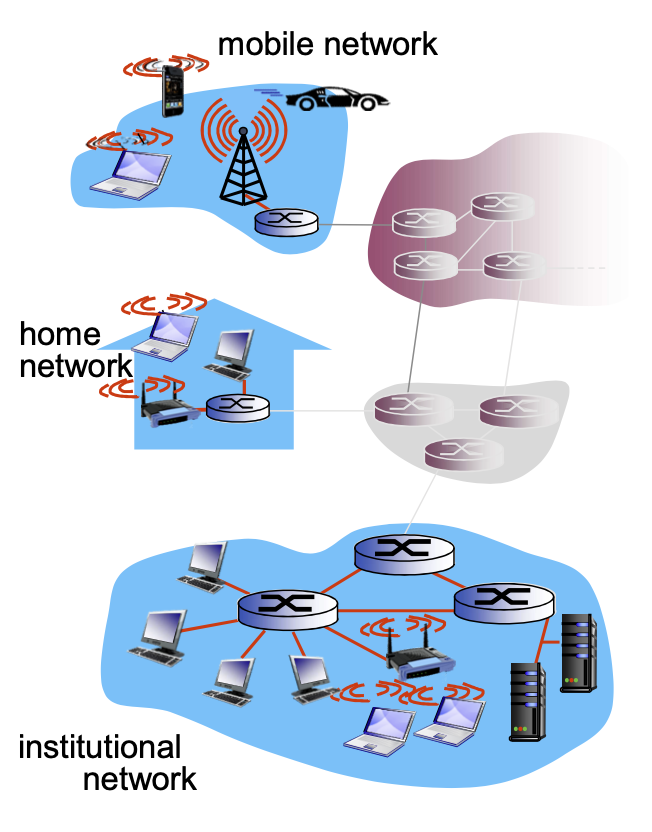
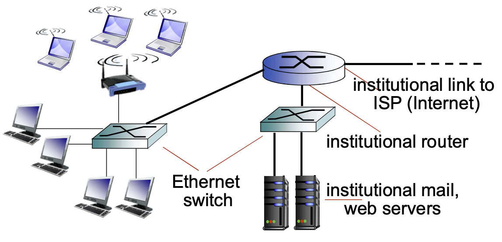
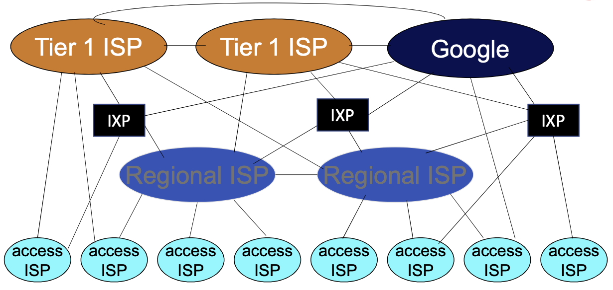
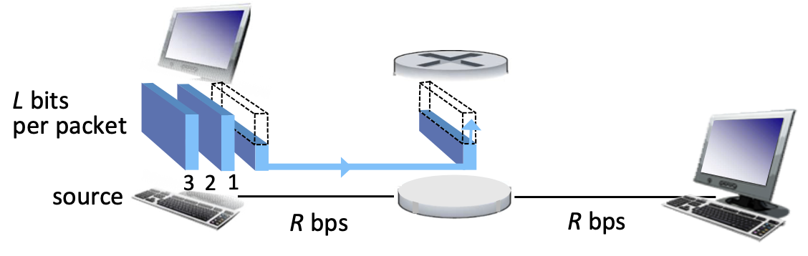
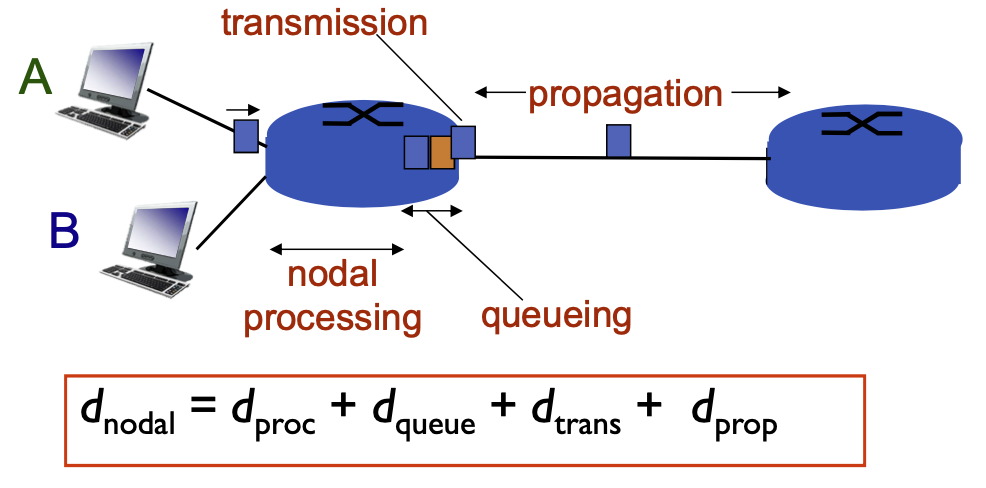
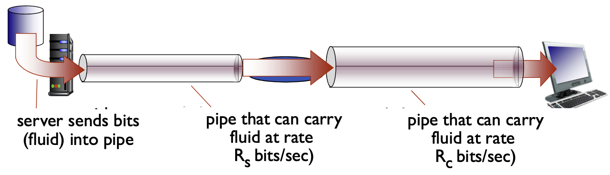

## Introduction to Computer Networks

This series of notes will have a comprehensive understanding of Computer Networks and how they work.

Networks are best understood as a mountain of subparts. There are two main models: ISO/OSI model, and the TCP/IP (Transmission control protocol, Internet Protocol) model. We focus on the TCP/IP model.

**The TCP/IP model** is:-

    

| Layer | Description |
| --- | --- |
| Application Layer | This is the topmost layer where users interact with network services through applications |
| Transport Layer | The transport layer ensures reliable data transfer between devices. |
| Network Layer| This layer is responsible for routing and forwarding data between devices on different networks. |
| Data link Layer| The data link layer ensures reliable communication between devices on the same local network. |
| Physical Layer| Transmission of Raw binary data over the physical medium |

In detail:

#### Application Layer

The Application layer is where the users interact directly with the network services via an application. Its an interface between users software and the network. Examples of some protocols are:

- **HTTP**: Hypertext Transfer Protocol for web
- **SMTP**: Simple Mail Transfer Protocol for email
- **DNS**: Domain Name System for domain names

#### Transport Layer

The Transport layer ensures reliable data transfer between different devices. Here, we think more on the data aspect. It breaks data into segments, manages error detection and correction, and controls the flow of data. Examples are:

- **TCP**: Transmission Control Protocol for reliable data transfer.
- **UDP**: User Datagram Protocol for unreliable but fast and connectionless data transfer.

#### Network Layer

The Network layer is responsible for routing and forwarding data between devices on different networks. It ensures that data reaches the intended destination. Examples are:

- **IP**: Internet Protocol for addressing and routing packets.
- **ICMP**: Internet Control Message Protocol for error reporting and diagnostics.

#### Data Link Layer

The Data Link layer is responsible for node-to-node communication and ensures reliable data transfer over the physical medium. It handles MAC (Media Access Control) and framing. Examples are:

- **Ethernet**: A widely used protocol for wired networks.
- **Wi-Fi (802.11)**: A protocol for wireless communication.
- **PPP**: Point-to-Point Protocol for direct connections between two nodes.

#### Physical Layer

The Physical layer deals with the actual transmission of raw data bits over physical hardware such as cables, radio waves, and fiber optics. It defines hardware specifications, signaling, and data encoding. Examples include:

- **Fiber Optic Cables**: High-speed data transmission medium.
- **Copper Cables (Ethernet, Coaxial, Twisted Pair)**: Common wired networking media.
- **Radio Waves (Wi-Fi, Bluetooth, Cellular)**: Wireless communication methods.

---

More definitions

What is a Computer Network?

A computer network is an infrastructure/system that facilitates the communication (information sharing) across computers/digital devices. Infrastructure includes communications devices, transmission media, and protocols.

**Basic Network Terminologies**

- **Client**: A device that requests resources or services from a server.
- **Server**: A device that provides resources or services to a client.
- **Peer**: A device that can act as either a client or a server.
- **End-hosts**: Both clients and servers.
- **Switch**: A device that connects multiple networks, forwarding data packets between them.
- **Router**: A device that connects multiple networks, forwarding data packets between them, and is used to route packets between networks.
- **Protocol**: A set of rules and standards used for communication between devices.
- **Segment**: A unit of data that is transmitted over a network.
- **Packet**: A formatted unit of data that is transmitted over a network.
- **Frame**: A formatted unit of data that is transmitted over a network at the data link layer.
- **Delay**: The time it takes for data to travel from one device to another.
- **Latency**: The time it takes for data to travel from one device to another, including any processing time.
- **Bandwidth**: The amount of data that can be transmitted over a network per unit of time.
- **Throughput**: The amount of data that is actually transmitted over a network per unit of time.
- **Loss**: The amount of data that is not successfully transmitted over a network.
- **Burst**: A short period of high data transmission volume.
- **Jitter**: The variation in delay between packets in a stream of data.

**Network and Communication Bytes**

The following table shows the different units used in computing and networking:

| Unit | Meaning | Equivalent in Bytes |
| --- | --- | --- |
| kB | Kilobyte (decimal) | 1000 bytes |
| KiB | Kibibyte (binary) | 1024 bytes |
| kb | Kilobit (decimal) | 1000 bits (125 bytes) |
| Kib | Kibibit (binary) | 1024 bits (128 bytes) |

The main difference between the two systems is that the decimal system is based on powers of 10, while the binary system is based on powers of 2. This means that 1 kilobyte (KB) in the decimal system is equal to 1000 bytes, while 1 kilobyte (KiB) in the binary system is equal to 1024 bytes. Similarly, 1 kilobit (Kb) in the binary system is equal to 1024 bits, while 1 kilobit (kb) in the decimal system is equal to 1000 bits.

---

### Networks and Protocols

**Key Aspects of Networking Protocols**

    

- **Syntax**: Defines the format and structure of messages.
- **Semantics**: Explains the meaning of each message and the procedures for exchanging information.
- **Sequence/Timing**: Specifies the order and timing of message exchanges.

**Key Design Principles**

- **Robustness Principle**: Be conservative in what you send and liberal in what you accept.
- **Layering Principle**: Layer N at the destination receives an exact copy of the message sent by Layer N at the source. All headers and modifications added by lower layers at the source must be removed by lower layers at the destination.
- **End-to-End Principle**: The network remains stateless, with only the end-hosts managing state.

**SDU and PDU**

SDU (Service Data Unit) -> Input data before headers are added, and 

PDU (Protocol Data unit) -> Output data after headers are added by a specific layer 

are important concepts to understand in layering. A higher layer sends an SDU, the lower layer adds headers and makes it a PDU (and this layers SDU).

The following table shows the different SDU and PDU values at each layer:

| Layer | SDU (Received from Above) | PDU (Transmitted Data) |
| --- | --- | --- |
| Application | Application Data | Application Data |
| Transport | Application Data | Segment (TCP/UDP Header + Data) |
| Network | Transport SDU (Segment) | Packet (IP Header + Segment) |
| Data Link | Network SDU (Packet) | Frame (Ethernet Header + Packet) |
| Physical | Data Link SDU (Frame) | Bits (Transmitted over the medium) |

Note, in Protocol Layering, each layer:

1. **Performs a subset of functions**: Each layer performs a subset of functions required for communication with another system.
2. **Relies on next lower layer**: Each layer relies on the next lower layer to perform more primitive functions.
3. **Provides service to next higher layer**: Each layer provides service to the next higher layer by implementing protocols for communication with peer layers in other systems.
4. Implements protocol for communication with peer layer in other systems

---

### Network Structure

The network structure consists of three main components:

1. **Network Edge**: This refers to the devices at the periphery of the network. It can be further categorized into:
   - **Mobile Devices**: Devices that are capable of roaming, such as smartphones and cars.
   - **Stationary Devices**: Fixed devices like desktop computers and printers.

2. **Access Network**: This is the segment that connects end devices to the network core, providing the initial link for communication. For example: Wired/wireless communication links.

3. **Network Core**: Serving as the backbone of the network, it includes:
   - **Switches**: Devices that manage data traffic and connect multiple network segments.
   - **Routers**: Devices that route data packets between different networks, ensuring efficient data delivery.

  

How are end systems connected edge router??

- Mobile Networks: Cellular / Satellite network
- Institutional Access Networks / Residential Acess networks: Cable Networks/Ethernet, WiFi Networks

    

**Network Core**

Q) What is Packet switching?
A) Packet switching is a method of transmitting data in which long messages are broken into a series of small packets, and each packet is given a header that contains its destination address. Packets are then transmitted independently and may follow different routes to the destination. At the destination, the packets are reassembled into the original message.

Q) What is routing?
A) Routing is the process of selecting paths in a network along which to send network traffic. It involves determining the optimal path for data to travel from the source to the destination, using routing algorithms to make decisions based on factors like network topology, traffic load, and link costs.

---

### Internet "Nuts and Bolts" Overview

The internet is essentially a vast network of interconnected networks, primarily managed by ISPs (Internet Service Providers). End systems connect to the internet through access ISPs, which in turn are interconnected to form the global web.

    

These access ISPs are linked to larger regional networks, major ISPs, and content provider networks.

**How do We Connect to the Internet?**

Devices come with a built-in MAC address, which is the physical address of the network interface. However, an IP address is assigned dynamically or statically by a router.

When connected to a university WiFi, the connection path is as follows:

1. **Your Device (Laptop/Phone)**
   - **MAC Address**: Permanent hardware address.
   - **Private IP**: Assigned by the university's WiFi router via DHCP (e.g., 192.168.1.100).

2. **University Network (WiFi Router & Firewall)**
   - **Router**: Assigns private IPs to connected devices.
   - **Public IP**: The university network has a public IP assigned by the ISP.
   - **NAT (Network Address Translation)**: Maps private IPs to the university’s public IP.

3. **ISP (Internet Service Provider)**
   - Provides the university with a public IP (e.g., 203.110.15.5).
   - Routes traffic between the university network and the broader internet.

4. **The Internet (Websites & Servers)**
   - External sites see the university's public IP, not your private IP.
   - The university's router directs data to the appropriate internal device, enabling network monitoring.

Using a VPN masks your public IP with that of the VPN server.

**IPv4 vs IPv6** 

| Feature | IPv4 | IPv6 |
| --- | --- | --- |
| Address Size | 32-bit (e.g., 192.168.1.1) | 128-bit (e.g., 2001:db8::ff00:42:8329) |
| Total Addresses | ~4.3 billion (limited, running out) | 340 undecillion (virtually unlimited) |
| Format | Dotted decimal (A.B.C.D) | Hexadecimal (8 groups of 4 hex digits) |
| Why Upgrade? | IPv4 is running out of addresses | IPv6 solves this issue |
| Who Uses? | Most networks today | Slowly being adopted |

**Mac Address** 📝

A MAC (Media Access Control) address is a unique hardware address assigned to a network device (like your laptop, phone, or router) by its manufacturer. It operates in the data-link layer. A MAC address uniquely identifies a device inside a local network, and used for that only, not for the internet.

Think of it like this:

MAC Address = Your House’s Physical Address (Never Changes). 🏠
IP Address = Your Postal Address for Mail Delivery (Changes when you move). 📨

**🔌 Ports**

A port is a logical endpoint in networking that helps devices distinguish between different types of communication happening over the internet or a local network. Think of ports like doors in a building: each door (port) leads to a different service running on a device, and the IP is the building's address. 🏢

**❓ How do they work?**

Whenever you send or receive data over the internet, your computer communicates using an IP address and a port number.

- **IP Address** → Identifies the device (e.g., 192.168.1.100).
- **Port Number** → Identifies the specific service or application (e.g., 80 for HTTP, 443 for HTTPS).

Together, they form a socket: `192.168.1.100:80` (IP:Port).

Ports range from 0 to 65535 and are divided into categories:

| 🔢 Port Range | 📂 Category | 🎯 Example Ports |
| --- | --- | --- |
| 0 – 1023 | Well-Known Ports (Reserved for standard services) | 80 (HTTP), 443 (HTTPS), 22 (SSH), 25 (SMTP), 53 (DNS) |
| 1024 – 49151 | Registered Ports (Used by applications) | 3306 (MySQL), 3389 (RDP), 27017 (MongoDB) |
| 49152 – 65535 | Dynamic/Ephemeral Ports (Temporary, assigned by OS for outbound connections) | Random ports used for web browsing |

**🌐 Examples:**

- **Example 1: Accessing a Website**
  - You enter https://www.google.com in your browser.
  - Your computer sends a request to Google's public IP on port 443 (HTTPS).
  - Google's web server responds from port 443 to a random port on your device (e.g., 49100).

- **Example 2: SSH into a Server**
  - You run: `ssh user@192.168.1.10 -p 22`
  - Your system connects to port 22 (SSH) on the target server.

> **Note:** Ports are virtual and not physical like USB or HDMI ports. ⚡

**🏠 Localhost**

Localhost is a special network address (loopback address) that always refers to your own device. It is used to test network services and applications without needing an actual network connection. 🔄

- Localhost IP Address:
  - **127.0.0.1** (IPv4)
  - **::1** (IPv6)

**🛠️ Examples:**

1. Running a Local Web Server on http://127.0.0.1:8000 (8000 is its port number)
2. Testing local SQL on localhost:3306 (its port number)

> **Note:** `0.0.0.0` means "all available IP addresses" on the system (used for listening to external connections). 🌐

---

### Network Performance

**Bandwidth:** Amount/Volume of Information/data per unit time that the transmission medium can handle. (i.e. the maximum capacity to transmit data per unit time.) - also known as link transmission rate (R). 💻

Throughput < Bandwidth

    

The host sending function
1. Takes the application message and splits into packets of length $L$. 📨
2. Transmits into access network at `transmission rate` $R$. ⚡
3. Packet transmission delay = $d_{trans}$ = $\frac{L}{R}$ ⏱
4. Then time is taken by the link to transmit the data.
5. Propagation delay = $d_{prop}$ = $\frac{d}{s}$ 🚀
6. Now, for different Packet switching diff times, for example in Store and Forward: Entire packet must arrive at router before it can be transmitted. 

    

**4 sources of Packet Delay**

1. $d_{trans}$ = Transmision delay (time to transmit the package from router/device to link) ⏱
2. $d_{queue}$ = Queing delay, if the arrival rate of packets to link is higher than transmission, then queing happens. 📊
3. $d_{prop}$ = Propagation delay (time move package along the link to other end) 🚀
4. $d_{proc}$ = Processing delay (time to process the package at the node) 💻

**Throughput**

    

Throughput: Rate at which bits get transferred between sender & receiver (bits/time unit) 📈

---

**What exactly is 3G-4G-5G-6G**

Generational improvements in mobile networks represent significant advancements in speed, latency, and connectivity. Each new 'G' (Generation) is declared when global telecom standards bodies (ITU, 3GPP) agree that significant improvements have been made in multiple aspects of networking. The transition from 3G → 4G → 5G → 6G is planned and standardized, and each new 'G' is declared when we see a major technological leap, supported by infrastructure and devices.

**Overview of each Generation**

| Generation | Speed | Latency | Key Features |
| --- | --- | --- | --- |
| 3G | ~2 Mbps | 100–500 ms | First mobile broadband, video calling, basic mobile internet |
| 4G | ~100 Mbps (LTE) | 30–50 ms | HD streaming, VoLTE (Voice over LTE), gaming, cloud services |
| 5G | ~10 Gbps | 1–10 ms | IoT, smart cities, AR/VR, autonomous vehicles, ultra-low latency |
| 6G | ~1 Tbps | <1 ms | AI-driven networks, holographic communication, quantum networking |

**Four key areas of improvement**

1. **Wireless Connections (Air Interface)** 📡
	+ Faster radio technologies
	+ Higher frequencies for more bandwidth
	+ Beamforming & small cells for efficient signal delivery
	+ Examples:
		- 3G → CDMA/WCDMA
		- 4G → LTE (OFDM-based)
		- 5G → mmWave, Massive MIMO
		- 6G → Terahertz (THz) communication
2. **Wired Infrastructure (Backhaul & Core Network)** 🏗️
	+ Higher generations need better fiber-optic backhaul to support higher speeds
	+ Examples:
		- 3G → Copper cables, slow data transfer
		- 4G → Fiber-optic backhaul, better routing
		- 5G → Distributed edge computing, ultra-fast fiber
		- 6G → AI-optimized network cores, satellite-based routing
3. **Network Protocols & Standards** 📜
	+ Each new 'G' comes with better networking protocols for efficient data transmission
	+ Examples:
		- 3G → Circuit-switched voice + packet-switched data
		- 4G → Fully packet-switched (IP-based, VoLTE)
		- 5G → Network slicing (customized networks for different use cases)
		- 6G → Expected to have AI-driven, software-defined networking (SDN)
4. **Computing & Processing Power** 💾
	+ Modern networks rely on edge computing and AI optimization to reduce latency
	+ Examples:
		- 3G/4G → Centralized core network
		- 5G → Edge computing (processing happens closer to users)
		- 6G → AI-managed, distributed computing networks

